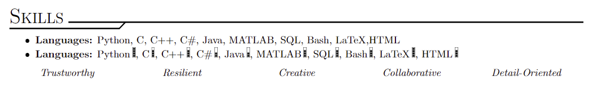
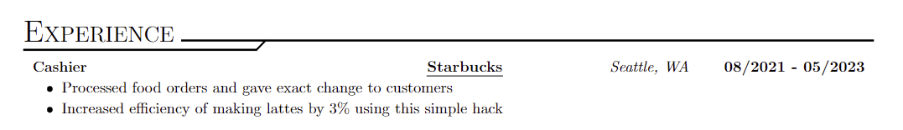
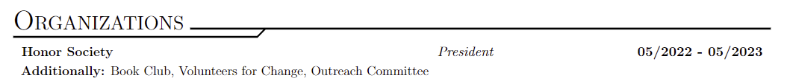

# ResumeTemp
This is the current repository for resume templating using the overpowered programming language for document formatting, LaTeX!

This project was made by Kevin Lizarazu-Ampuero using LaTeX on VSCode. Look at the Setup section for help on how to make this project work on your local machine, specifically VSCode.

# Setup
If you are planning to modify these files on your local computer using VSCode, you will need the following installations:

- LaTeX Workshop extension by James Yu on VSCode
- [MikTex](https://miktex.org/download) latest x64 version
- [Strawberry Perl](https://strawberryperl.com/) latest 64-bit version

The VSCode extension might be bothered by another pdf viewer if you have one already so make sure to only have that one enabled when compiling LaTeX code.

If you have trouble, refer to the video: [Tutorial Installation Video](https://www.youtube.com/watch?v=4lyHIQl4VM8)

# Features
With this template you can rest assure you've got the most fly resume on the job market!

- **Title**
    - Contains hyperlinks that can direct viewers to profiles and websites
    - Nice free-use icons that are tied to their respective field
    
- **Education**
    - Sets the tone for component titling with degree name, school name, school location, and dates attended
    - Also additional command for separate learning
    
- **Skills**
    - Bulleted lists are the main focus, giving you the option to list what you want
    - Alternate listing exists for soft skills that is desirable when showcasing top 5 skills
    
- **Experience**
    - Follows the education section with component titling except scaled down to fit which can be changed
    - Takes from the skills section their bulleted list for descriptions
    
- **Projects**
    - Follows the experience section with component titling except for location and instead has project association
    - Takes from the skills section their bulleted list for descriptions
    
- **Organizations**
    - Follows the projects section with component titling
    - Breaks up adding organizations into single and multiple in case there isn't room and single organizations contain critical leadership
    

If a PDF is successfully compiled but there are no visible changes, close and reset the PDF previewer, make sure not to have the PDF open elsewhere while editing

# Future
No plans have been made for future development after this version is released. If there is request for clarification or collaboration my email remains lizarazukevin@vt.edu. Thanks!